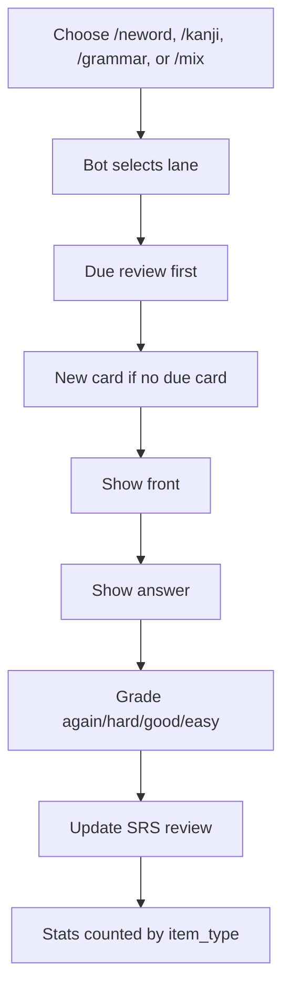

# Learning Lanes Usage

## Concept

Bot has one SRS system and three focused lanes:

- `neword` / `vocab`: vocabulary cards
- `kanji`: kanji cards
- `grammar`: grammar cards

Each lane has its own stats and goal. Reviews stay in `user_learning_reviews` and are separated by `learning_items.item_type`.

## Workflow



## Commands

```text
/neword          study vocabulary
/vocab           same as /neword
/kanji           study kanji
/grammar         study grammar
/mix             study all lanes together
/stats           overall flashcard stats
/stats_neword    vocabulary stats
/stats_kanji     kanji stats
/stats_grammar   grammar stats
/goal_neword     set vocabulary goal
/goal_kanji      set kanji goal
/goal_grammar    set grammar goal
```

## Examples

Vocabulary session:

```text
/neword
Hiện đáp án
Nhớ
/stats_neword
```

Kanji session:

```text
/kanji
Hiện đáp án
Khó
/stats_kanji
```

Grammar session:

```text
/grammar
Hiện đáp án
Dễ
/stats_grammar
```

Mixed session:

```text
/mix
Hiện đáp án
Nhớ
Thẻ tiếp theo
```

## Goal Defaults

```text
neword/vocab: 10 new cards, 50 reviews per day
kanji:        3 new cards, 30 reviews per day
grammar:      2 new cards, 20 reviews per day
```

Use `/goal_neword`, `/goal_kanji`, or `/goal_grammar` to choose light, steady, or heavy presets for each lane.
