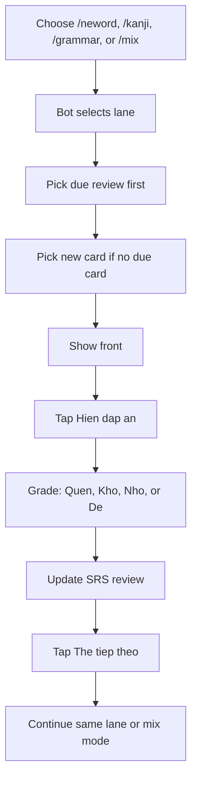

# Learning Lanes Usage

## Concept

Bot has one SRS system and three focused lanes:

- `neword` / `vocab`: vocabulary cards
- `kanji`: kanji cards
- `grammar`: grammar cards

Each lane has its own stats and goal. Reviews stay in `user_learning_reviews` and are separated by `learning_items.item_type`.

## Standard Workflow



Important behavior:

- Start with `/kanji`: `The tiep theo` continues kanji.
- Start with `/neword` or `/vocab`: `The tiep theo` continues vocabulary.
- Start with `/grammar`: `The tiep theo` continues grammar.
- Start with `/mix`: `The tiep theo` continues mixed study.
- If you open stats from a lane, the stats screen also keeps the same `The tiep theo` mode.

## Commands

```text
/neword          study vocabulary
/vocab           same as /neword
/kanji           study kanji
/grammar         study grammar
/mix             study all lanes together
/stats           overall flashcard stats
/stats_neword    vocabulary stats
/stats_kanji     kanji stats
/stats_grammar   grammar stats
/goal_neword     set vocabulary goal
/goal_kanji      set kanji goal
/goal_grammar    set grammar goal
/lane_settings   show deck/tag filters for each lane
/lane_deck       set lane deck filter
/lane_tags       set lane tag filter
/help            show common commands
```

Advanced commands still exist but are hidden from `/help` to keep normal usage simple:

```text
/flash_type vocab|kanji|grammar|kaiwa
/flash_deck n4_vocab_core
/flash_tags food,verb
```

## Lane Deck And Tag Filters

Use these commands when you want one lane to study only one deck or tag group:

```text
/lane_settings
/lane_deck <neword|kanji|grammar> <deck|all>
/lane_tags <neword|kanji|grammar> <tags|all>
```

Kanji deck/tag example:

```text
/lane_deck kanji n4_kanji_core
/lane_tags kanji jlpt,weak
/kanji
```

Neword deck/tag example:

```text
/lane_deck neword n4_vocab_core
/lane_tags neword food,verb
/neword
```

Clear filters:

```text
/lane_deck kanji all
/lane_tags kanji all
```

`/mix` uses each lane's own deck/tag settings.

## Kanji Only Session

```text
/kanji
Hien dap an
Nho
The tiep theo
The tiep theo
/stats_kanji
```

Use this when you want all next cards to stay in kanji mode.

## Switch From Kanji To Neword

```text
/kanji
Hien dap an
Kho
The tiep theo

/neword
Hien dap an
Nho
The tiep theo
/stats_neword
```

Typing `/neword` changes the active lane to vocabulary. After that, `The tiep theo` continues vocabulary.

## Grammar Only Session

```text
/grammar
Hien dap an
De
The tiep theo
/stats_grammar
```

## Mixed Session

```text
/mix
Hien dap an
Nho
The tiep theo
The tiep theo
```

Mix mode chooses from vocab, kanji, and grammar. It prioritizes due reviews before new cards.

## Goal Defaults

```text
neword/vocab: 10 new cards, 50 reviews per day
kanji:        3 new cards, 30 reviews per day
grammar:      2 new cards, 20 reviews per day
```

Use `/goal_neword`, `/goal_kanji`, or `/goal_grammar` to choose light, steady, or heavy presets for each lane.

## Restart After Code Changes

If command behavior or `/help` still looks old after deployment, restart the bot process:

```powershell
docker compose restart bot
```

If it still uses old behavior:

```powershell
docker compose up -d --force-recreate bot
```
