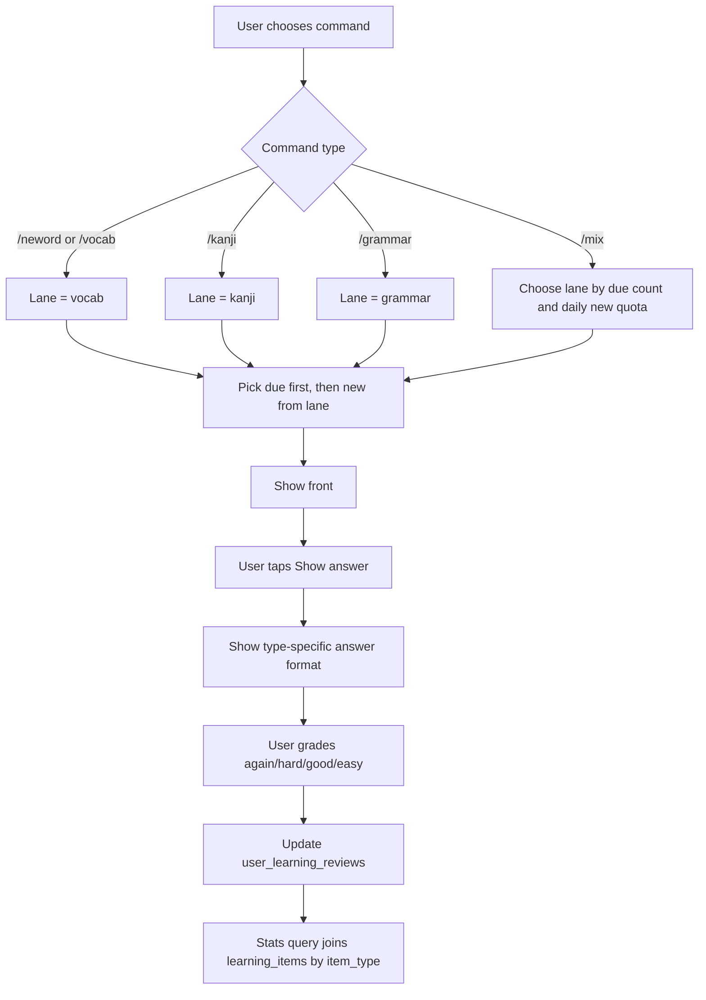

# Typed Learning Lanes Implementation Plan

> **For agentic workers:** REQUIRED SUB-SKILL: Use superpowers:subagent-driven-development (recommended) or superpowers:executing-plans to implement this plan task-by-task. Steps use checkbox (`- [ ]`) syntax for tracking.

**Goal:** Add separate study lanes for new word, kanji, and grammar so each lane has its own commands, goal limits, and statistics while sharing the existing `learning_items` SRS engine.

**Architecture:** Keep one Telegram bot and one SRS review table. Use `learning_items.item_type` as the lane boundary and add one small lane settings table for per-type goals. Add shortcut commands (`/neword`, `/kanji`, `/grammar`, `/mix`) plus stats commands that filter by lane.

**Tech Stack:** Python 3.11, SQLite, python-telegram-bot, pytest, Docker Compose.

---

## Review Summary For User

### Do we need DB changes?

Yes, but small.

Existing DB already supports separate progress by type because:

```text
learning_items.item_type = vocab | kanji | grammar | kaiwa
user_learning_reviews.learning_item_id -> learning_items.id
```

So per-type review stats can be calculated without changing review rows.

Add only this table for separate goals/settings per lane:

```text
user_learning_lane_settings
  telegram_user_id INTEGER NOT NULL
  item_type TEXT NOT NULL
  level TEXT NOT NULL DEFAULT 'N4'
  deck_id TEXT
  tags TEXT
  daily_new_limit INTEGER NOT NULL
  daily_review_limit INTEGER NOT NULL
  again_delay_minutes INTEGER NOT NULL
  created_at TEXT NOT NULL DEFAULT CURRENT_TIMESTAMP
  updated_at TEXT NOT NULL DEFAULT CURRENT_TIMESTAMP
  PRIMARY KEY (telegram_user_id, item_type)
```

Do not change these tables:

```text
learning_items
user_learning_reviews
user_learning_sessions
```

### New commands

```text
/neword          học từ mới, item_type=vocab
/vocab           alias của /neword
/kanji           học kanji, item_type=kanji
/grammar         học ngữ pháp, item_type=grammar
/mix             học xen kẽ vocab, kanji, grammar
/stats           thống kê tổng
/stats_neword    thống kê vocab
/stats_kanji     thống kê kanji
/stats_grammar   thống kê grammar
/goal_neword     chọn goal vocab
/goal_kanji      chọn goal kanji
/goal_grammar    chọn goal grammar
```

Keep old commands working:

```text
/flash
/flash_new
/flash_review
/flash_stats
/flash_goal
/flash_settings
/flash_type vocab|kanji|grammar|kaiwa
```

### Workflow



### Usage guide

Daily focused study:

```text
/neword
Hiện đáp án
Nhớ
/neword
```

Kanji-only review:

```text
/kanji
Hiện đáp án
Khó
/stats_kanji
```

Grammar-only review:

```text
/grammar
Hiện đáp án
Dễ
/stats_grammar
```

Mixed study:

```text
/mix
Hiện đáp án
Nhớ
Thẻ tiếp theo
```

Stats behavior:

```text
/stats_neword  -> only item_type=vocab
/stats_kanji   -> only item_type=kanji
/stats_grammar -> only item_type=grammar
/stats         -> all item types
```

---

## File Structure

- Modify `src/learning_items.py`: schema migration, lane settings, lane stats helpers, mix picker.
- Modify `src/flashcard_handlers.py`: lane commands, lane stats formatting, lane goal callbacks, mix command.
- Modify `src/bot.py`: register new commands.
- Modify `src/flashcard_scheduler.py`: keep existing daily reminder behavior and ensure new lane commands do not change scheduled dispatch.
- Modify `tests/test_learning_items_schema.py`: assert lane settings table exists.
- Create `tests/test_learning_lanes.py`: unit tests for lane settings, lane stats, lane picker, mix picker.
- Modify `tests/test_flashcard_handlers.py`: formatter/help tests for new commands.
- Create `docs/learning-lanes-usage.md`: user guide with workflow and command examples.
- Modify `README.md`: link short command summary.

---

### Task 1: Add Lane Settings Table

**Files:**
- Modify: `src/learning_items.py`
- Modify: `tests/test_learning_items_schema.py`

- [ ] **Step 1: Write failing schema test**

Add to `tests/test_learning_items_schema.py`:

```python
def test_init_learning_db_creates_lane_settings_table(tmp_path, monkeypatch):
    db_path = tmp_path / "learning.sqlite3"
    monkeypatch.setattr(learning_items, "DATABASE_PATH", str(db_path))

    learning_items.init_learning_db()

    assert "user_learning_lane_settings" in learning_items.list_tables()
```

- [ ] **Step 2: Run test to verify failure**

Run:

```powershell
docker compose run --rm bot pytest tests/test_learning_items_schema.py::test_init_learning_db_creates_lane_settings_table -q
```

Expected: FAIL with assertion because table does not exist.

- [ ] **Step 3: Add schema**

In `src/learning_items.py`, inside `init_learning_db()`, after `user_learning_settings` creation, add:

```python
    cursor.execute("""
        CREATE TABLE IF NOT EXISTS user_learning_lane_settings (
            telegram_user_id INTEGER NOT NULL,
            item_type TEXT NOT NULL,
            level TEXT NOT NULL DEFAULT 'N4',
            deck_id TEXT,
            tags TEXT,
            daily_new_limit INTEGER NOT NULL,
            daily_review_limit INTEGER NOT NULL,
            again_delay_minutes INTEGER NOT NULL,
            created_at TEXT NOT NULL DEFAULT CURRENT_TIMESTAMP,
            updated_at TEXT NOT NULL DEFAULT CURRENT_TIMESTAMP,
            PRIMARY KEY (telegram_user_id, item_type)
        )
    """)
    cursor.execute("""
        CREATE INDEX IF NOT EXISTS idx_user_learning_lane_settings_user
        ON user_learning_lane_settings(telegram_user_id, item_type)
    """)
```

- [ ] **Step 4: Run test to verify pass**

Run:

```powershell
docker compose run --rm bot pytest tests/test_learning_items_schema.py -q
```

Expected: PASS.

- [ ] **Step 5: Commit**

Run:

```powershell
git add src/learning_items.py tests/test_learning_items_schema.py
git commit -m "feat: add learning lane settings table"
```

---

### Task 2: Add Lane Settings API

**Files:**
- Modify: `src/learning_items.py`
- Create: `tests/test_learning_lanes.py`

- [ ] **Step 1: Write failing tests**

Create `tests/test_learning_lanes.py`:

```python
import learning_items


def test_get_lane_settings_uses_type_defaults(tmp_path, monkeypatch):
    db_path = tmp_path / "learning.sqlite3"
    monkeypatch.setattr(learning_items, "DATABASE_PATH", str(db_path))

    settings = learning_items.get_lane_settings(123, "kanji")

    assert settings["item_type"] == "kanji"
    assert settings["level"] == "N4"
    assert settings["daily_new_limit"] == 3
    assert settings["daily_review_limit"] == 30


def test_set_lane_goal_preserves_other_lane(tmp_path, monkeypatch):
    db_path = tmp_path / "learning.sqlite3"
    monkeypatch.setattr(learning_items, "DATABASE_PATH", str(db_path))

    learning_items.set_lane_goal(123, "vocab", daily_new_limit=10, daily_review_limit=50)
    learning_items.set_lane_goal(123, "grammar", daily_new_limit=2, daily_review_limit=20)

    vocab = learning_items.get_lane_settings(123, "vocab")
    grammar = learning_items.get_lane_settings(123, "grammar")

    assert vocab["daily_new_limit"] == 10
    assert vocab["daily_review_limit"] == 50
    assert grammar["daily_new_limit"] == 2
    assert grammar["daily_review_limit"] == 20
```

- [ ] **Step 2: Run tests to verify failure**

Run:

```powershell
docker compose run --rm bot pytest tests/test_learning_lanes.py::test_get_lane_settings_uses_type_defaults tests/test_learning_lanes.py::test_set_lane_goal_preserves_other_lane -q
```

Expected: FAIL because `get_lane_settings` and `set_lane_goal` do not exist.

- [ ] **Step 3: Add constants and helpers**

In `src/learning_items.py`, near `DEFAULT_SETTINGS`, add:

```python
LANE_DEFAULTS = {
    "vocab": {"daily_new_limit": 10, "daily_review_limit": 50, "again_delay_minutes": 10},
    "kanji": {"daily_new_limit": 3, "daily_review_limit": 30, "again_delay_minutes": 10},
    "grammar": {"daily_new_limit": 2, "daily_review_limit": 20, "again_delay_minutes": 10},
}
LANE_ALIASES = {"neword": "vocab", "vocab": "vocab", "kanji": "kanji", "grammar": "grammar"}


def normalize_lane(item_type):
    lane = LANE_ALIASES.get(str(item_type or "").strip().lower())
    if not lane:
        raise ValueError(f"Invalid learning lane: {item_type}")
    return lane
```

Add settings API:

```python
def get_lane_settings(telegram_user_id, item_type):
    init_learning_db()
    lane = normalize_lane(item_type)
    defaults = {
        "telegram_user_id": telegram_user_id,
        "item_type": lane,
        "level": "N4",
        "deck_id": None,
        "tags": None,
        **LANE_DEFAULTS[lane],
    }
    conn = get_connection()
    cursor = conn.cursor()
    cursor.execute("""
        SELECT * FROM user_learning_lane_settings
        WHERE telegram_user_id = ? AND item_type = ?
    """, (telegram_user_id, lane))
    row = cursor.fetchone()
    conn.close()
    if not row:
        return defaults
    settings = dict(defaults)
    settings.update(dict(row))
    return settings


def set_lane_goal(telegram_user_id, item_type, *, daily_new_limit, daily_review_limit, again_delay_minutes=10, level="N4", deck_id=None, tags=None):
    init_learning_db()
    lane = normalize_lane(item_type)
    now = utc_now().isoformat()
    conn = get_connection()
    cursor = conn.cursor()
    cursor.execute("""
        INSERT INTO user_learning_lane_settings (
            telegram_user_id, item_type, level, deck_id, tags, daily_new_limit,
            daily_review_limit, again_delay_minutes, created_at, updated_at
        ) VALUES (?, ?, ?, ?, ?, ?, ?, ?, ?, ?)
        ON CONFLICT(telegram_user_id, item_type) DO UPDATE SET
            level = excluded.level,
            deck_id = excluded.deck_id,
            tags = excluded.tags,
            daily_new_limit = excluded.daily_new_limit,
            daily_review_limit = excluded.daily_review_limit,
            again_delay_minutes = excluded.again_delay_minutes,
            updated_at = excluded.updated_at
    """, (
        telegram_user_id, lane, level, deck_id, normalize_tags(tags), daily_new_limit,
        daily_review_limit, again_delay_minutes, now, now,
    ))
    conn.commit()
    conn.close()
    return get_lane_settings(telegram_user_id, lane)
```

- [ ] **Step 4: Run tests to verify pass**

Run:

```powershell
docker compose run --rm bot pytest tests/test_learning_lanes.py -q
```

Expected: PASS.

- [ ] **Step 5: Commit**

Run:

```powershell
git add src/learning_items.py tests/test_learning_lanes.py
git commit -m "feat: add learning lane settings"
```

---

### Task 3: Add Lane Stats And Pickers

**Files:**
- Modify: `src/learning_items.py`
- Modify: `tests/test_learning_lanes.py`

- [ ] **Step 1: Add failing lane stats test**

Append to `tests/test_learning_lanes.py`:

```python
import datetime as dt


def _now():
    return dt.datetime(2026, 6, 22, 12, 0, tzinfo=dt.timezone.utc)


def _item(item_id, item_type, source_position):
    return {
        "item_id": item_id,
        "level": "N4",
        "item_type": item_type,
        "deck_id": f"n4_{item_type}_core",
        "source": "unit",
        "source_position": source_position,
        "front": item_id,
        "meaning": "meaning",
        "status": "ready",
    }


def test_get_lane_stats_filters_by_item_type(tmp_path, monkeypatch):
    db_path = tmp_path / "learning.sqlite3"
    monkeypatch.setattr(learning_items, "DATABASE_PATH", str(db_path))
    learning_items.upsert_learning_item(_item("VOCAB-1", "vocab", 1))
    learning_items.upsert_learning_item(_item("KANJI-1", "kanji", 2))

    vocab_stats = learning_items.get_lane_stats(123, "neword", now=_now())
    kanji_stats = learning_items.get_lane_stats(123, "kanji", now=_now())

    assert vocab_stats["total"] == 1
    assert vocab_stats["new"] == 1
    assert kanji_stats["total"] == 1
    assert kanji_stats["new"] == 1
```

- [ ] **Step 2: Add failing lane picker test**

Append to `tests/test_learning_lanes.py`:

```python
def test_pick_next_lane_item_only_returns_requested_lane(tmp_path, monkeypatch):
    db_path = tmp_path / "learning.sqlite3"
    monkeypatch.setattr(learning_items, "DATABASE_PATH", str(db_path))
    learning_items.upsert_learning_item(_item("VOCAB-1", "vocab", 1))
    learning_items.upsert_learning_item(_item("KANJI-1", "kanji", 2))

    item = learning_items.pick_next_lane_item(123, "kanji", now=_now())

    assert item["item_type"] == "kanji"
    assert item["front"] == "KANJI-1"
```

- [ ] **Step 3: Run tests to verify failure**

Run:

```powershell
docker compose run --rm bot pytest tests/test_learning_lanes.py::test_get_lane_stats_filters_by_item_type tests/test_learning_lanes.py::test_pick_next_lane_item_only_returns_requested_lane -q
```

Expected: FAIL because lane helpers do not exist.

- [ ] **Step 4: Add helpers**

In `src/learning_items.py`, add:

```python
def _lane_filters(settings):
    return {
        "level": settings.get("level"),
        "item_type": settings.get("item_type"),
        "deck_id": settings.get("deck_id"),
        "tags": settings.get("tags"),
    }


def get_lane_stats(telegram_user_id, item_type, now=None):
    settings = get_lane_settings(telegram_user_id, item_type)
    return get_learning_stats(telegram_user_id, now=now, **_lane_filters(settings))


def pick_next_lane_item(telegram_user_id, item_type, now=None):
    settings = get_lane_settings(telegram_user_id, item_type)
    return pick_next_item(telegram_user_id, now=now, **_lane_filters(settings))


def pick_due_lane_item(telegram_user_id, item_type, now=None):
    settings = get_lane_settings(telegram_user_id, item_type)
    return pick_due_item(telegram_user_id, now=now, **_lane_filters(settings))


def pick_new_lane_item(telegram_user_id, item_type):
    settings = get_lane_settings(telegram_user_id, item_type)
    return pick_new_item(telegram_user_id, **_lane_filters(settings))
```

- [ ] **Step 5: Run tests to verify pass**

Run:

```powershell
docker compose run --rm bot pytest tests/test_learning_lanes.py -q
```

Expected: PASS.

- [ ] **Step 6: Commit**

Run:

```powershell
git add src/learning_items.py tests/test_learning_lanes.py
git commit -m "feat: add typed learning lane pickers"
```

---

### Task 4: Add Mix Picker

**Files:**
- Modify: `src/learning_items.py`
- Modify: `tests/test_learning_lanes.py`

- [ ] **Step 1: Add failing mix tests**

Append to `tests/test_learning_lanes.py`:

```python
def test_pick_mix_item_prefers_due_lane_before_new(tmp_path, monkeypatch):
    db_path = tmp_path / "learning.sqlite3"
    monkeypatch.setattr(learning_items, "DATABASE_PATH", str(db_path))
    vocab_id = learning_items.upsert_learning_item(_item("VOCAB-1", "vocab", 1))
    learning_items.upsert_learning_item(_item("KANJI-1", "kanji", 2))
    learning_items.ensure_user_review(123, vocab_id, _now())
    learning_items.save_review_state(123, vocab_id, {
        "state": "review",
        "due_at": "2026-06-21T12:00:00+00:00",
        "interval_days": 1,
        "ease_factor": 2.5,
        "repetitions": 1,
        "lapses": 0,
        "last_reviewed_at": "2026-06-20T12:00:00+00:00",
    })

    item = learning_items.pick_mix_item(123, now=_now())

    assert item["item_type"] == "vocab"
    assert item["id"] == vocab_id


def test_pick_mix_item_returns_none_when_no_lane_has_cards(tmp_path, monkeypatch):
    db_path = tmp_path / "learning.sqlite3"
    monkeypatch.setattr(learning_items, "DATABASE_PATH", str(db_path))

    assert learning_items.pick_mix_item(123, now=_now()) is None
```

- [ ] **Step 2: Run tests to verify failure**

Run:

```powershell
docker compose run --rm bot pytest tests/test_learning_lanes.py::test_pick_mix_item_prefers_due_lane_before_new tests/test_learning_lanes.py::test_pick_mix_item_returns_none_when_no_lane_has_cards -q
```

Expected: FAIL because `pick_mix_item` does not exist.

- [ ] **Step 3: Implement mix picker**

In `src/learning_items.py`, add:

```python
MIX_LANES = ("vocab", "kanji", "grammar")


def pick_mix_item(telegram_user_id, now=None, lanes=MIX_LANES):
    now = now or utc_now()
    lane_stats = []
    for lane in lanes:
        settings = get_lane_settings(telegram_user_id, lane)
        stats = get_learning_stats(telegram_user_id, now=now, **_lane_filters(settings))
        lane_stats.append((lane, settings, stats))

    for lane, settings, stats in sorted(lane_stats, key=lambda row: (-row[2]["due"], row[0])):
        if stats["due"] > 0 and settings["daily_review_limit"] > 0:
            item = pick_due_item(telegram_user_id, now=now, **_lane_filters(settings))
            if item:
                return item

    for lane, settings, stats in sorted(lane_stats, key=lambda row: (-row[1]["daily_new_limit"], row[0])):
        if stats["new"] > 0 and settings["daily_new_limit"] > 0:
            item = pick_new_item(telegram_user_id, **_lane_filters(settings))
            if item:
                return item

    return None
```

Note: this mix version chooses the lane with the most due cards first, then the lane with the larger daily new quota. It uses existing per-lane stats and does not add a separate daily quota consumption table.

- [ ] **Step 4: Run tests to verify pass**

Run:

```powershell
docker compose run --rm bot pytest tests/test_learning_lanes.py -q
```

Expected: PASS.

- [ ] **Step 5: Commit**

Run:

```powershell
git add src/learning_items.py tests/test_learning_lanes.py
git commit -m "feat: add mixed learning picker"
```

---

### Task 5: Add Bot Commands For Lanes

**Files:**
- Modify: `src/flashcard_handlers.py`
- Modify: `src/bot.py`
- Modify: `tests/test_flashcard_handlers.py`

- [ ] **Step 1: Add failing help test**

Add to `tests/test_flashcard_handlers.py`:

```python
def test_format_help_lists_learning_lane_commands():
    text = handlers.format_help()

    assert "/neword" in text
    assert "/kanji" in text
    assert "/grammar" in text
    assert "/mix" in text
    assert "/stats_neword" in text
    assert "/stats_kanji" in text
    assert "/stats_grammar" in text
```

- [ ] **Step 2: Run test to verify failure**

Run:

```powershell
docker compose run --rm bot pytest tests/test_flashcard_handlers.py::test_format_help_lists_learning_lane_commands -q
```

Expected: FAIL because help text lacks commands.

- [ ] **Step 3: Add handler helpers**

In `src/flashcard_handlers.py`, add:

```python
LANE_LABELS = {
    "vocab": "Từ mới",
    "kanji": "Kanji",
    "grammar": "Ngữ pháp",
}


async def _send_lane_card(update: Update, item_type: str):
    user_id = update.effective_user.id
    card = learning_items.pick_next_lane_item(user_id, item_type)
    if not card:
        await update.message.reply_text(f"Chưa có thẻ {LANE_LABELS[learning_items.normalize_lane(item_type)].lower()} phù hợp.")
        return
    await _send_card_to_message(update.message, user_id, card)


async def neword(update: Update, context: ContextTypes.DEFAULT_TYPE):
    await _send_lane_card(update, "vocab")


async def vocab(update: Update, context: ContextTypes.DEFAULT_TYPE):
    await _send_lane_card(update, "vocab")


async def kanji(update: Update, context: ContextTypes.DEFAULT_TYPE):
    await _send_lane_card(update, "kanji")


async def grammar(update: Update, context: ContextTypes.DEFAULT_TYPE):
    await _send_lane_card(update, "grammar")


async def mix(update: Update, context: ContextTypes.DEFAULT_TYPE):
    user_id = update.effective_user.id
    card = learning_items.pick_mix_item(user_id)
    await _send_card_to_message(update.message, user_id, card)
```

Update `format_help()` command list with:

```text
/neword - học từ mới
/kanji - học kanji
/grammar - học ngữ pháp
/mix - học xen kẽ từ mới, kanji, ngữ pháp
/stats_neword - thống kê từ mới
/stats_kanji - thống kê kanji
/stats_grammar - thống kê ngữ pháp
```

- [ ] **Step 4: Register commands**

In `src/bot.py`, after existing flash command registrations, add:

```python
    application.add_handler(CommandHandler("neword", flashcard_handlers.neword))
    application.add_handler(CommandHandler("vocab", flashcard_handlers.vocab))
    application.add_handler(CommandHandler("kanji", flashcard_handlers.kanji))
    application.add_handler(CommandHandler("grammar", flashcard_handlers.grammar))
    application.add_handler(CommandHandler("mix", flashcard_handlers.mix))
```

- [ ] **Step 5: Run tests and compile check**

Run:

```powershell
docker compose run --rm bot pytest tests/test_flashcard_handlers.py tests/test_learning_lanes.py -q
docker compose run --rm bot python -m py_compile src/bot.py src/flashcard_handlers.py src/learning_items.py
```

Expected: PASS and compile exits 0.

- [ ] **Step 6: Commit**

Run:

```powershell
git add src/flashcard_handlers.py src/bot.py tests/test_flashcard_handlers.py
git commit -m "feat: add typed learning commands"
```

---

### Task 6: Add Lane Stats Commands

**Files:**
- Modify: `src/flashcard_handlers.py`
- Modify: `src/bot.py`
- Modify: `tests/test_flashcard_handlers.py`

- [ ] **Step 1: Add formatter tests**

Add to `tests/test_flashcard_handlers.py`:

```python
def test_format_lane_stats_includes_lane_name():
    text = handlers.format_lane_stats("kanji", {
        "total": 12,
        "new": 3,
        "due": 2,
        "learning": 1,
        "review": 6,
        "lapses": 0,
    }, today_count=4)

    assert "Tiến độ Kanji" in text
    assert "Tổng thẻ: 12" in text
    assert "Đã chấm: 4" in text
```

- [ ] **Step 2: Run test to verify failure**

Run:

```powershell
docker compose run --rm bot pytest tests/test_flashcard_handlers.py::test_format_lane_stats_includes_lane_name -q
```

Expected: FAIL because `format_lane_stats` does not exist.

- [ ] **Step 3: Add format and handlers**

In `src/flashcard_handlers.py`, add:

```python
def format_lane_stats(item_type, stats, today_count=None):
    lane = learning_items.normalize_lane(item_type)
    title = LANE_LABELS[lane]
    base = format_stats(stats, today_count=today_count)
    return base.replace("Tiến độ flashcard", f"Tiến độ {title}", 1)


async def _send_lane_stats(update: Update, item_type: str):
    user_id = update.effective_user.id
    lane = learning_items.normalize_lane(item_type)
    settings = learning_items.get_lane_settings(user_id, lane)
    stats = learning_items.get_lane_stats(user_id, lane)
    today_cards = learning_items.get_reviewed_items_between(
        user_id,
        settings.get("level"),
        *_today_bounds_utc(),
        limit=30,
        item_type=lane,
        deck_id=settings.get("deck_id"),
        tags=settings.get("tags"),
    )
    await update.message.reply_text(format_lane_stats(lane, stats, today_count=len(today_cards)), reply_markup=stats_keyboard())


async def stats_neword(update: Update, context: ContextTypes.DEFAULT_TYPE):
    await _send_lane_stats(update, "vocab")


async def stats_kanji(update: Update, context: ContextTypes.DEFAULT_TYPE):
    await _send_lane_stats(update, "kanji")


async def stats_grammar(update: Update, context: ContextTypes.DEFAULT_TYPE):
    await _send_lane_stats(update, "grammar")
```

- [ ] **Step 4: Register commands**

In `src/bot.py`, add:

```python
    application.add_handler(CommandHandler("stats_neword", flashcard_handlers.stats_neword))
    application.add_handler(CommandHandler("stats_kanji", flashcard_handlers.stats_kanji))
    application.add_handler(CommandHandler("stats_grammar", flashcard_handlers.stats_grammar))
```

- [ ] **Step 5: Run tests and compile check**

Run:

```powershell
docker compose run --rm bot pytest tests/test_flashcard_handlers.py tests/test_learning_lanes.py -q
docker compose run --rm bot python -m py_compile src/bot.py src/flashcard_handlers.py src/learning_items.py
```

Expected: PASS and compile exits 0.

- [ ] **Step 6: Commit**

Run:

```powershell
git add src/flashcard_handlers.py src/bot.py tests/test_flashcard_handlers.py
git commit -m "feat: add typed learning stats"
```

---

### Task 7: Add Lane Goal Commands

**Files:**
- Modify: `src/flashcard_handlers.py`
- Modify: `src/bot.py`
- Modify: `tests/test_flashcard_handlers.py`

- [ ] **Step 1: Add keyboard test**

Add to `tests/test_flashcard_handlers.py`:

```python
def test_lane_goal_keyboard_has_neword_callbacks():
    markup = handlers.lane_goal_keyboard("vocab")
    buttons = [button for row in markup.inline_keyboard for button in row]

    assert ("Nhẹ", "flash:lane_goal:vocab:light") in [(button.text, button.callback_data) for button in buttons]
    assert ("Đều", "flash:lane_goal:vocab:steady") in [(button.text, button.callback_data) for button in buttons]
    assert ("Nặng", "flash:lane_goal:vocab:heavy") in [(button.text, button.callback_data) for button in buttons]
```

- [ ] **Step 2: Run test to verify failure**

Run:

```powershell
docker compose run --rm bot pytest tests/test_flashcard_handlers.py::test_lane_goal_keyboard_has_neword_callbacks -q
```

Expected: FAIL because `lane_goal_keyboard` does not exist.

- [ ] **Step 3: Add presets and keyboard**

In `src/flashcard_handlers.py`, add:

```python
LANE_GOAL_PRESETS = {
    "vocab": {
        "light": (5, 25),
        "steady": (10, 50),
        "heavy": (15, 80),
    },
    "kanji": {
        "light": (1, 15),
        "steady": (3, 30),
        "heavy": (5, 50),
    },
    "grammar": {
        "light": (1, 10),
        "steady": (2, 20),
        "heavy": (4, 40),
    },
}


def lane_goal_keyboard(item_type):
    lane = learning_items.normalize_lane(item_type)
    return InlineKeyboardMarkup([[
        InlineKeyboardButton("Nhẹ", callback_data=f"flash:lane_goal:{lane}:light"),
        InlineKeyboardButton("Đều", callback_data=f"flash:lane_goal:{lane}:steady"),
        InlineKeyboardButton("Nặng", callback_data=f"flash:lane_goal:{lane}:heavy"),
    ]])
```

Add command handlers:

```python
async def goal_neword(update: Update, context: ContextTypes.DEFAULT_TYPE):
    await update.message.reply_text("Chọn goal từ mới:", reply_markup=lane_goal_keyboard("vocab"))


async def goal_kanji(update: Update, context: ContextTypes.DEFAULT_TYPE):
    await update.message.reply_text("Chọn goal kanji:", reply_markup=lane_goal_keyboard("kanji"))


async def goal_grammar(update: Update, context: ContextTypes.DEFAULT_TYPE):
    await update.message.reply_text("Chọn goal ngữ pháp:", reply_markup=lane_goal_keyboard("grammar"))
```

In `handle_flashcard_callback`, before `flash:today:list`, add:

```python
    if data.startswith("flash:lane_goal:"):
        _, _, lane, preset = data.split(":")
        daily_new, daily_review = LANE_GOAL_PRESETS[lane][preset]
        settings = learning_items.set_lane_goal(
            user_id,
            lane,
            daily_new_limit=daily_new,
            daily_review_limit=daily_review,
        )
        await query.edit_message_text(
            f"Đã cập nhật goal {LANE_LABELS[lane]}: {settings['daily_new_limit']} thẻ mới/ngày, {settings['daily_review_limit']} ôn/ngày."
        )
        return
```

- [ ] **Step 4: Register commands**

In `src/bot.py`, add:

```python
    application.add_handler(CommandHandler("goal_neword", flashcard_handlers.goal_neword))
    application.add_handler(CommandHandler("goal_kanji", flashcard_handlers.goal_kanji))
    application.add_handler(CommandHandler("goal_grammar", flashcard_handlers.goal_grammar))
```

- [ ] **Step 5: Run tests and compile check**

Run:

```powershell
docker compose run --rm bot pytest tests/test_flashcard_handlers.py tests/test_learning_lanes.py -q
docker compose run --rm bot python -m py_compile src/bot.py src/flashcard_handlers.py src/learning_items.py
```

Expected: PASS and compile exits 0.

- [ ] **Step 6: Commit**

Run:

```powershell
git add src/flashcard_handlers.py src/bot.py tests/test_flashcard_handlers.py
git commit -m "feat: add typed learning goals"
```

---

### Task 8: Document Workflow And Usage

**Files:**
- Create: `docs/learning-lanes-usage.md`
- Modify: `README.md`

- [ ] **Step 1: Create usage doc**

Create `docs/learning-lanes-usage.md` with:

````markdown
# Learning Lanes Usage

## Concept

The bot has one SRS system and three focused lanes:

- `neword` / `vocab`: vocabulary cards
- `kanji`: kanji cards
- `grammar`: grammar cards

Each lane has its own stats and goal. Reviews are stored in the same `user_learning_reviews` table and separated by `learning_items.item_type`.

## Workflow

```mermaid
flowchart TD
    A["Choose /neword, /kanji, /grammar, or /mix"] --> B["Bot selects lane"]
    B --> C["Due review first"]
    C --> D["New card if no due card"]
    D --> E["Show front"]
    E --> F["Show answer"]
    F --> G["Grade again/hard/good/easy"]
    G --> H["Update SRS review"]
    H --> I["Stats counted by item_type"]
````

## Commands

```text
/neword          study vocabulary
/vocab           same as /neword
/kanji           study kanji
/grammar         study grammar
/mix             study all lanes together
/stats           overall flashcard stats
/stats_neword    vocabulary stats
/stats_kanji     kanji stats
/stats_grammar   grammar stats
/goal_neword     set vocabulary goal
/goal_kanji      set kanji goal
/goal_grammar    set grammar goal
```

## Examples

Vocabulary session:

```text
/neword
Hiện đáp án
Nhớ
/stats_neword
```

Kanji session:

```text
/kanji
Hiện đáp án
Khó
/stats_kanji
```

Mixed session:

```text
/mix
Hiện đáp án
Nhớ
Thẻ tiếp theo
```
```

- [ ] **Step 2: Update README**

Add this short section under bot commands in `README.md`:

````markdown
Typed learning lane commands:

```text
/neword          học từ mới
/vocab           alias của /neword
/kanji           học kanji
/grammar         học ngữ pháp
/mix             học xen kẽ từ mới, kanji, ngữ pháp
/stats_neword    thống kê từ mới
/stats_kanji     thống kê kanji
/stats_grammar   thống kê ngữ pháp
/goal_neword     chọn goal từ mới
/goal_kanji      chọn goal kanji
/goal_grammar    chọn goal ngữ pháp
````

See `docs/learning-lanes-usage.md` for workflow and examples.
```

- [ ] **Step 3: Verify docs contain commands**

Run:

```powershell
Select-String -Path README.md,docs\learning-lanes-usage.md -Pattern "/neword", "/kanji", "/grammar", "/mix", "stats_neword"
```

Expected: every pattern appears at least once.

- [ ] **Step 4: Commit**

Run:

```powershell
git add README.md docs/learning-lanes-usage.md
git commit -m "docs: add typed learning lane usage"
```

---

### Task 9: Final Verification

**Files:**
- Verify all changed files.

- [ ] **Step 1: Run targeted tests**

Run:

```powershell
docker compose run --rm bot pytest tests/test_learning_items_schema.py tests/test_learning_lanes.py tests/test_flashcard_handlers.py -q
```

Expected: PASS.

- [ ] **Step 2: Run full suite**

Run:

```powershell
docker compose run --rm bot pytest -q
```

Expected: PASS.

- [ ] **Step 3: Compile changed Python files**

Run:

```powershell
docker compose run --rm bot python -m py_compile src/bot.py src/learning_items.py src/flashcard_handlers.py src/flashcard_scheduler.py
```

Expected: exit code 0 with no output.

- [ ] **Step 4: Inspect git status**

Run:

```powershell
git status --short
```

Expected: only intended files changed before final commit, then clean after commit.

---

## Self-Review

- Spec coverage: plan covers separate study commands, per-type stats, per-type goals, mix workflow, DB impact, usage docs.
- Placeholder scan: no red-flag placeholders remain.
- Type consistency: public lane values are `neword`, `vocab`, `kanji`, `grammar`; internal canonical values are `vocab`, `kanji`, `grammar`.
- Scope check: one cohesive feature; no separate subsystem split needed.
