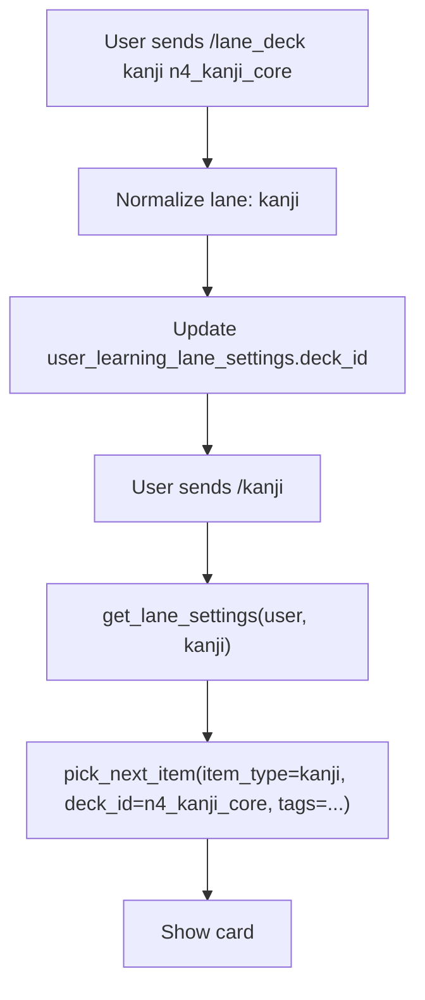

# Lane Deck And Tag Settings Design

## Goal

Allow each learning lane to keep its own deck and tag filters while keeping goal mode/preset global.

Lanes:

```text
neword -> vocab
vocab  -> vocab
kanji  -> kanji
grammar -> grammar
```

## Non-goals

- Do not add per-lane `jlpt_sprint`, `light`, `steady`, or `heavy` modes.
- Do not change `/flash_goal`; it remains the global mode/preset entry point.
- Do not reset or migrate existing review progress.
- Do not import data as part of this feature.

## Current State

The DB table `user_learning_lane_settings` already stores lane-specific fields:

```text
telegram_user_id
item_type
level
deck_id
tags
daily_new_limit
daily_review_limit
again_delay_minutes
```

Existing lane pickers already read lane settings through `get_lane_settings()` and pass `deck_id` and `tags` into `pick_next_item()` / stats queries. The missing part is command UX for changing `deck_id` and `tags` per lane.

## Commands

Add three user-facing commands:

```text
/lane_settings
/lane_deck <lane> <deck_id|all>
/lane_tags <lane> <tag1,tag2|all>
```

Examples:

```text
/lane_deck kanji n4_kanji_core
/lane_tags kanji jlpt,weak

/lane_deck neword n4_vocab_core
/lane_tags neword food,verb

/lane_deck grammar all
/lane_tags grammar all
```

`all` clears the filter:

```text
/lane_deck kanji all   -> deck_id = NULL
/lane_tags kanji all   -> tags = NULL
```

## Behavior

After setting kanji filters:

```text
/lane_deck kanji n4_kanji_core
/lane_tags kanji jlpt,weak
/kanji
```

The bot picks only ready learning items where:

```text
item_type = kanji
deck_id = n4_kanji_core
tags contain jlpt and weak
```

After setting vocab filters:

```text
/lane_deck neword n4_vocab_core
/lane_tags neword food,verb
/neword
```

The bot picks only ready learning items where:

```text
item_type = vocab
deck_id = n4_vocab_core
tags contain food and verb
```

Stats commands use the same lane settings:

```text
/stats_kanji   -> filtered by kanji lane deck/tags
/stats_neword  -> filtered by vocab lane deck/tags
/stats_grammar -> filtered by grammar lane deck/tags
```

`/mix` uses each lane's own settings when choosing cards.

## Help Text

Keep `/help` simple but include the new lane setting commands:

```text
/lane_settings - xem filter tung lane
/lane_deck <lane> <deck|all> - chon deck cho lane
/lane_tags <lane> <tags|all> - chon tags cho lane
```

Keep advanced global filter commands hidden from `/help`:

```text
/flash_type
/flash_deck
/flash_tags
```

## Data Flow



## Error Handling

Invalid lane:

```text
Usage: /lane_deck neword|kanji|grammar <deck|all>
```

Missing deck/tag argument:

```text
Usage: /lane_tags neword|kanji|grammar <tags|all>
```

Unknown deck ID is allowed at command time. If it matches no cards, `/kanji` or `/neword` will show the existing no-card message. This keeps the command simple and avoids needing a deck catalog lookup in handlers.

## Testing

Add tests for:

- `set_lane_filter()` stores `deck_id` and normalized tags per lane.
- Setting one lane does not affect another lane.
- `all` clears `deck_id` or `tags`.
- `/lane_settings` formats each lane with deck/tags.
- `/lane_deck` and `/lane_tags` validate args and call backend setter.
- Existing `/kanji`, `/neword`, `/grammar`, `/mix` pickers continue using lane filters.

